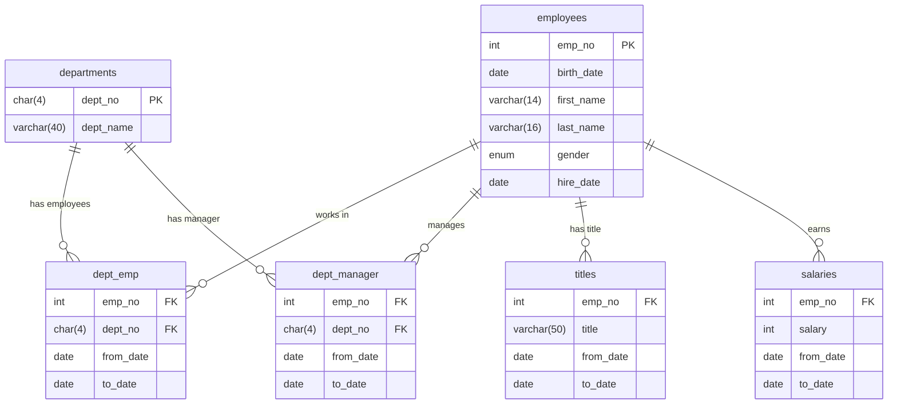

# Employee Database Schema

## Overview
This document describes the structure of the employee database system, which consists of six interconnected tables managing employee information, departments, and their relationships.

## Database Tables

### 1. employees
Primary table containing employee personal information.

**Columns:**
- `emp_no` (INT, Primary Key) - Unique employee number
- `birth_date` (DATE) - Employee's date of birth
- `first_name` (VARCHAR(14)) - Employee's first name
- `last_name` (VARCHAR(16)) - Employee's last name
- `gender` (ENUM('M','F')) - Employee's gender
- `hire_date` (DATE) - Date when employee was hired

**Indexes:**
- Primary key on `emp_no`

### 2. departments
Contains all department information.

**Columns:**
- `dept_no` (CHAR(4), Primary Key) - Unique department identifier
- `dept_name` (VARCHAR(40)) - Department name

**Indexes:**
- Primary key on `dept_no`

### 3. dept_emp
Associates employees with departments (many-to-many relationship).

**Columns:**
- `emp_no` (INT) - Employee number (Foreign Key to employees.emp_no)
- `dept_no` (CHAR(4)) - Department number (Foreign Key to departments.dept_no)
- `from_date` (DATE) - Start date of employee in department
- `to_date` (DATE) - End date of employee in department

**Indexes:**
- Composite key/index on (`emp_no`, `dept_no`)

### 4. dept_manager
Tracks department managers over time.

**Columns:**
- `emp_no` (INT) - Employee number of the manager (Foreign Key to employees.emp_no)
- `dept_no` (CHAR(4)) - Department number (Foreign Key to departments.dept_no)
- `from_date` (DATE) - Start date as manager
- `to_date` (DATE) - End date as manager

**Indexes:**
- Composite key/index on (`emp_no`, `dept_no`)

### 5. titles
Records employee job titles and their duration.

**Columns:**
- `emp_no` (INT) - Employee number (Foreign Key to employees.emp_no)
- `title` (VARCHAR(50)) - Job title
- `from_date` (DATE) - Start date of the title
- `to_date` (DATE) - End date of the title

**Indexes:**
- Composite key/index on (`emp_no`, `title`, `from_date`)

### 6. salaries
Contains employee salary history.

**Columns:**
- `emp_no` (INT) - Employee number (Foreign Key to employees.emp_no)
- `salary` (INT) - Salary amount
- `from_date` (DATE) - Start date of salary
- `to_date` (DATE) - End date of salary

**Indexes:**
- Composite key/index on (`emp_no`, `from_date`)

## Entity Relationship Diagram

## Relationships

### One-to-Many Relationships:
- **employees → dept_emp**: One employee can work in multiple departments over time
- **employees → dept_manager**: One employee can manage multiple departments over time
- **employees → titles**: One employee can have multiple titles over time
- **employees → salaries**: One employee can have multiple salary records over time
- **departments → dept_emp**: One department can have multiple employees
- **departments → dept_manager**: One department can have multiple managers over time

### Many-to-Many Relationships:
- **employees ↔ departments**: Implemented through `dept_emp` and `dept_manager` junction tables

## Key Design Patterns

1. **Temporal Data**: Most relationships include `from_date` and `to_date` columns to track historical changes
2. **Junction Tables**: `dept_emp` and `dept_manager` serve as junction tables for many-to-many relationships
3. **Normalized Structure**: The database follows normalization principles to minimize redundancy
4. **Employee-Centric**: The `emp_no` serves as the central identifier linking all employee-related data

## Common Query Patterns

1. **Current Employees**: Filter using `to_date = '9999-01-01'` or `to_date > CURRENT_DATE`
2. **Department History**: Join `employees` with `dept_emp` and `departments`
3. **Salary History**: Join `employees` with `salaries` ordered by `from_date`
4. **Management Structure**: Join `dept_manager` with `employees` and `departments`
5. **Title Progression**: Track career progression through `titles` table ordered by `from_date`